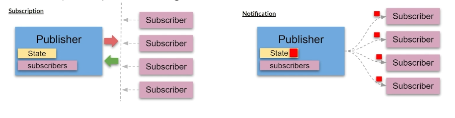
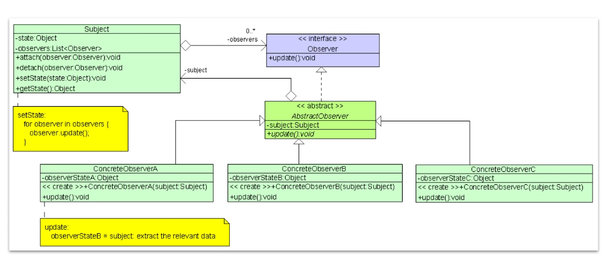

# Observer Pattern

The **Observer Pattern** is a very interesting, useful, and dynamic pattern.

## Overview

1. The main intent of the pattern is to create an **event notification 
   mechanism** between objects.
2. Think of the relationship between a publisher and a subscriber:
   - A **Subscriber** subscribes to a **Publisher** of events.
   - When an event happens the **Publisher** notifies all the **Subscribers** 
     in its list that the event has happened

This pattern perfectly suits any process where data arrives from some input 
that is not available at a predefined moment, but instead arrives "at random" 
(for example **HTTP requests**, **user input from peripherals**, 
**distributed databases** and **blockchains**, etc.)

The **Observer Pattern** is also a key part in the well known and utilized 
**Model-View-Controller (MVC)** architectural pattern.

## Motivation

The **Observer pattern** is one of the most useful design patterns.

Here is the motivation of the pattern as stated by **GoF**:

> **Define a one-to-many dependency between objects so that when one object 
> changes state, all its dependents are notified and updated automatically.**

### Related Patterns

**Chain of Responsibility**, **Command**, **Mediator** and **Observer** all 
address different ways of connecting senders and receivers of requests:

- **Chain of Responsibility** is used to pass a request sequentially along a 
  chain of receivers until one of them handles it.

- **Command** is used to establish a unidirectional responsibility between a 
  sender and a receiver.

- **Mediator** (also known as **Controller**) removes direct connections 
  between senders and receivers, forcing them to communicate indirectly via a 
  mediator/controller object.

## When to use

1. Use the **Observer pattern** when changes to the state of one object need 
   to be 'known' by other objects. Especially when the actual set of the 
   other objects is either unknown initially or changes dynamically 
   throughout the lifecycle of the application.
2. Use it when an object or a set of objects need to 'observe' changes in 
   other objects and need to be notified in **real-time** about those 
   changes.

## When not to use

1. Because the order of notifications is potentially random, be careful about 
   your requirements if order of notifications is important.

## Pros:
1. You can introduce new subscriber implementations without having to change the publisher's code. This is compatible with the **Open/Closed Principle (OCP)**.
2. It supports the principle of **Loose Coupling** between objects that interact with each other.
3. You can establish relationships between objects **dynamically at runtime**.
4. If you think about it, the **Observer pattern** is the key to **reactive behaviour**.

## Cons:
1. The order in which observers/subscribers are notified is potentially random.
2. Debugging notifications can be difficult given the random nature of notifications.

## Design Considerations:
1. **Look for elements** in your business logic that need to be aware of state data changes.
2. **Break it down into two parts**:
   a. The controller/receiver of the events. This will be your **Publisher**.
   b. The components that need to be aware of those changes. These will be the **Subscribers**.
3. **Declare the Subscriber interface** which should at least have a single update or notify method.
4. **Declare the Publisher interface** and define the contract for adding and removing subscribers.
5. **Create an abstract Publisher implementation** with a mechanism for subscriber management and notification.
6. **Identify the state data** that will need to be 'observed' and create a concrete Publisher implementation for that state. Define a way for subscribers to get access to that state.
7. **Create specific implementation** of subscribers that you need.
