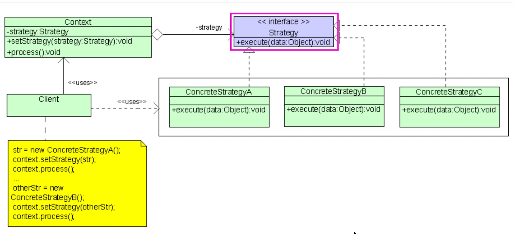

# Strategy Pattern

The Strategy Pattern is a behavioral design pattern that enables selecting an algorithm's behavior at runtime.

The main idea of the Strategy Design Pattern is to extract related algorithms (or any piece of code) into separate classes and define a common interface for them.

It defines a family of algorithms, encapsulates each one, and makes them interchangeable.
This pattern allows the algorithm to vary independently from clients that use it.

In other words, it is a very dynamic design pattern that allows your code to be flexible depending on the run-time dynamic.

## Considerations

The Strategy is considered to be one of the most practical design patterns.

Here is its motivation:

'Define a family of algorithms, encapsulate each one, and make them interchangeable.
Strategy lets the algorithm vary independently from clients that use it.`

1. State can be considered as an extension of Strategy. Both patterns utilize composition at their core: they allow the modification of their process by delegating work to helper objects. Strategy makes these objects completely independent and unaware of each other. However, State allows the objects to alter their behaviour when internal state changes.
2. Command and Strategy seem similar, but have different motivations:
    a. Command allows for conversion of any operation into an object.
    b. Strategy allows for objects to achieve the same thing but in different ways.

**When to use**:
1. Use this pattern to abstract the business logic of a class from its implementation details so that it can be 'plugged in'.
2. Use it when your class has a potential conditional statement that switches between different variants of the same algorithm.
3. Use the Strategy pattern when you want to use different variants/version of an algorithm within an object and need to have the ability to switch from one algorithm to another during runtime.

**When not to use**:
1. If you only have a few algorithms and they rarely change, it might be
unnecessary to overcomplicate your code with new classes and interfaces.

**Pros:***
1. In the strategy pattern, the behavior of a class should not be inherited, but
instead, the behavior should be abstracted and encapsulated using interfaces.
This is compatible with the Open/Closed Principle (OCP), which proposes that
classes should be open for extension but closed for modification.
2. You can introduce new Strategies into the context without breaking any client
code. This follows the Open/Closed Principle.
**Cons:**
1. Clients must be aware of the differences between strategies to be able to
select a proper one.
