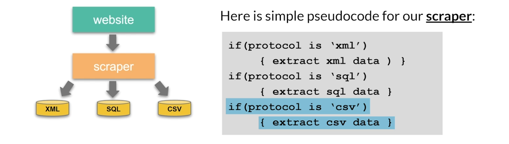
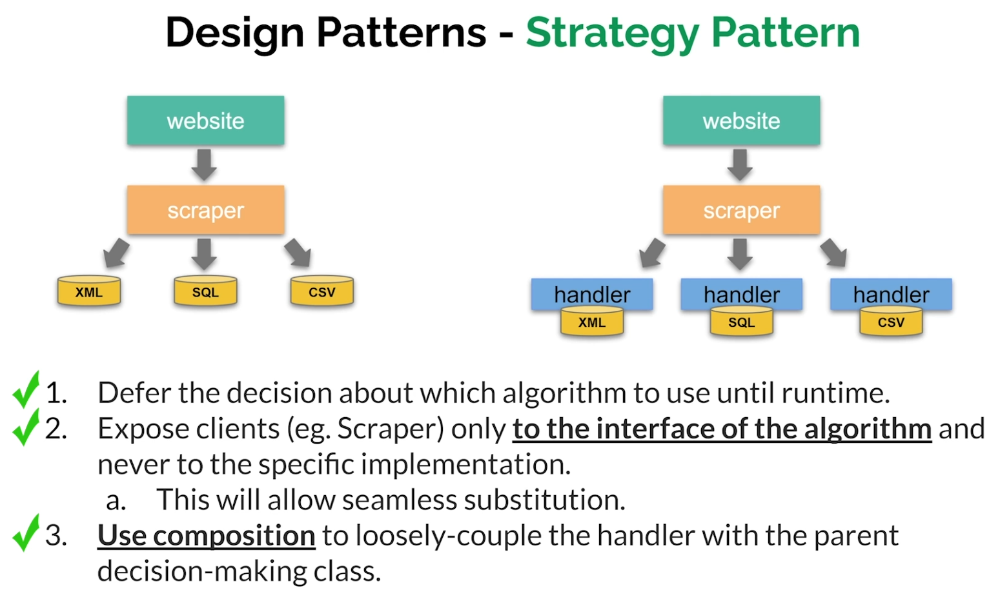

# Strategy Pattern Example
Consider the following scenario:
1. Let's assume that you have a web bot (i.e. like a web crawler) and you want it to scrape some data from the internet.
2. You might be interested in data content such as XML files, SQL files, CSV files, perhaps JSON files, etc...

**Wrong Approach**



What is the problem with allowing the scraper to handle all the logic of scraping?
There are a few reasons why you do not want to have the scraper handle all those different protocols:
1. The Scraper class will grow uncontrollably with each new data protocol.
2. The extraction code is not reusable.
3. The design violates the SOLID principles, specifically the Open/CIosed Principle which states that we should extend the class NOT modify it.
One aspect of the solution would be to abstract each protocol into its own class and then have the Scraper call that specific class when needed.

**Right Approach**




```python
from abc import ABC, abstractmethod
import pygame
import pygame_gui
from moviepy.editor import *
import pygame_gui

# Base Renderer class with an abstract render method.
class WidgetRenderer(ABC):
    abstractmethod
    def render(self, screen, ui_manager) -> str:
        pass

# ImageRenderer class that inherits from the Renderer class
class ImageRenderer(WidgetRenderer):
    def __init__(self, image_path, size=None):
        self.image_path = image_path  # Path of the image file
        self.image = None  # Placeholder for the loaded image
        self.size = size  # Desired size for the image (width, height)

    # Method to load the image and optionally resize it.
    def load_image(self):
        self.image = pygame.image.load(self.image_path)
        if self.size:
            self.image = pygame.transform.scale(self.image, self.size)

    # Render method to display the image on the screen.
    def render(self, screen, ui_manager):
        if not self.image:
            self.load_image()
        screen.blit(self.image, (200, 70))
        return "Rendering an image", None

# VideoRenderer class that inherits from the Renderer class
class VideoRenderer(WidgetRenderer):
    def __init__(self, video_path, size=None):
        self.video_path = video_path  # Path of the video file
        self.clip = None  # Placeholder for the loaded video clip
        self.playing = False  # Flag to indicate if the video is currently playing
        self.start_time = 0  # Timestamp for when the video starts playing
        self.size = size  # Desired size for the video (width, height)

    # Method to load the video clip and optionally resize it.
    def load_movie(self):
        self.clip = VideoFileClip(self.video_path)
        if self.size:
            self.clip = self.clip.resize(self.size)

    # Render method to display the video on the screen.
    def render(self, screen, ui_manager):
        if not self.clip:
            self.load_movie()
        current_time = pygame.time.get_ticks() / 1000
        if not self.playing:
            self.playing = True
            self.start_time = current_time

        if self.playing:
            elapsed_time = current_time - self.start_time
            if elapsed_time < self.clip.duration:
                frame = self.clip.get_frame(elapsed_time)
                frame = pygame.surfarray.make_surface(frame.swapaxes(0, 1))
                screen.blit(frame, (200, 70))
            else:
                self.playing = False
        return "Rendering a video", None

    # Method to stop the video playback.
    def stop(self):
        self.playing = False

# FormRenderer class that inherits from the Renderer class
class FormRenderer(WidgetRenderer):
    def __init__(self):
        self.form_elements = []  # List to store form elements
        self.panel = None  # Placeholder for the form panel

    # Method to create the form with the input fields and labels.
    def create_form(self, ui_manager):
        # Panel creation and configuration.
        self.panel = pygame_gui.elements.UIPanel(relative_rect=pygame.Rect((300, 60), (260, 480)),
                                                 starting_layer_height=1,
                                                 manager=ui_manager,
                                                 object_id="form_panel",
                                                 anchors={"left": "left",
                                                          "right": "right",
                                                          "top": "top",
                                                          "bottom": "bottom"})
        
        # Create and configure form elements (labels, input fields, and submit button)
        # Add elements to the form_elements list and set the container as the panel.
        # ...
        self.form_elements.append(pygame_gui.elements.UILabel(relative_rect=pygame.Rect((30, 10), (200, 40)),
                                                                text="First Name",
                                                                manager=ui_manager,
                                                                container=self.panel))
        self.form_elements.append(pygame_gui.elements.UITextEntryLine(relative_rect=pygame.Rect((30, 50), (200, 40)),
                                                                       manager=ui_manager,
                                                                       container=self.panel))
        self.form_elements.append(pygame_gui.elements.UILabel(relative_rect=pygame.Rect((30, 110), (200, 40)),
                                                                text="Last Name",
                                                                manager=ui_manager,
                                                                container=self.panel))
        self.form_elements.append(pygame_gui.elements.UITextEntryLine(relative_rect=pygame.Rect((30, 150), (200, 40)),
                                                                       manager=ui_manager,
                                                                       container=self.panel))
        self.form_elements.append(pygame_gui.elements.UILabel(relative_rect=pygame.Rect((30, 210), (200, 40)),
                                                                text="Phone Number",
                                                                manager=ui_manager,
                                                                container=self.panel))
        self.form_elements.append(pygame_gui.elements.UITextEntryLine(relative_rect=pygame.Rect((30, 250), (200, 40)),
                                                                       manager=ui_manager,
                                                                       container=self.panel))
        self.form_elements.append(pygame_gui.elements.UILabel(relative_rect=pygame.Rect((30, 310), (200, 40)),
                                                                text="Email Address",
                                                                manager=ui_manager,
                                                                container=self.panel))
        self.form_elements.append(pygame_gui.elements.UITextEntryLine(relative_rect=pygame.Rect((30, 350), (200, 40)),
                                                                       manager=ui_manager,
                                                                       container=self.panel))
        self.form_elements.append(pygame_gui.elements.UIButton(relative_rect=pygame.Rect((80, 410), (100, 40)),
                                                                text="Submit",
                                                                manager=ui_manager,
                                                                container=self.panel))

    # Render method to display the form on the screen.
    def render(self, screen, ui_manager):
        if not self.form_elements:
            self.create_form(ui_manager)

        return "Rendering a form", None

    # Method to clear the form elements from the screen.
    def clear_form(self):
        for element in self.form_elements:
            element.kill()
        self.form_elements = []
        if self.panel:
            self.panel.kill()
            self.panel = None

# RenderingContext class to manage the current rendering context.
class RenderingContext:
    def __init__(self, renderer: WidgetRenderer):
        self._renderer = renderer  # The current renderer instance

    # Method to set the current renderer.
    def set_renderer(self, renderer: WidgetRenderer):
        self._renderer = renderer

    # Render method to delegate rendering to the current renderer.
    def render(self, screen, ui_manager):
        return self._renderer.render(screen, ui_manager)

#
# Main function to set up and run the application.
#
def main():
    pygame.init()
    
    screen = pygame.display.set_mode((800, 600))
    pygame.display.set_caption("Renderer Strategy Pattern Example")
    ui_manager = pygame_gui.UIManager((800, 600))

    # Initialize the RenderingContext with an ImageRenderer instance.
    context = RenderingContext(ImageRenderer("python_design_patterns.png", size=(550, 325)))

    # Create and configure UI buttons for selecting renderers.
    # 
    image_button = pygame_gui.elements.UIButton(relative_rect=pygame.Rect((20, 20), (100, 40)),
                                                text="Image",
                                                manager=ui_manager)
    video_button = pygame_gui.elements.UIButton(relative_rect=pygame.Rect((20, 70), (100, 40)),
                                                text="Video",
                                                manager=ui_manager)
    widget_button = pygame_gui.elements.UIButton(relative_rect=pygame.Rect((20, 120), (100, 40)),
                                                text="Widget",
                                                manager=ui_manager)

    rendered_widget = None

    clock = pygame.time.Clock()
    running = True
    while running:
        # calculate the delta time in seconds by asking for a max number of frames per second
        # to be 60 and then divide the tick time (which is in milliseconds) by a 1000 to get 
        # elapsed time in seconds
        time_delta = clock.tick(60)/1000.0
        for event in pygame.event.get():
            if event.type == pygame.QUIT:
                running = False

            # Process button click events and change the renderer accordingly.
            #
            if event.type == pygame.USEREVENT:
                if event.user_type == pygame_gui.UI_BUTTON_PRESSED:
                    if isinstance(context._renderer, FormRenderer):
                        context._renderer.clear_form()
                    if event.ui_element == image_button:
                        context.set_renderer(ImageRenderer("python_design_patterns.png", size=(550, 325)))
                    elif event.ui_element == video_button:
                        context.set_renderer(VideoRenderer("example_video.mp4", size=(550, 325)))
                    elif event.ui_element == widget_button:
                        context.set_renderer(FormRenderer())

            ui_manager.process_events(event)

        # Update the screen and UI elements.
        screen.fill((200, 200, 200))
        ui_manager.update(time_delta)
        ui_manager.draw_ui(screen)

        # Call the render method of the current context.
        result_text, widget = context.render(screen, ui_manager)

        # Display the result text on the screen.
        font = pygame.font.Font(None, 36)
        text = font.render(result_text, 1, (10, 10, 10))
        screen.blit(text, (300, 20))

        # Update the rendered widget.
        if rendered_widget:
            rendered_widget.kill()
        if widget:
            rendered_widget = widget

        pygame.display.update()

    pygame.quit()

if __name__ == "__main__":
    main()
```