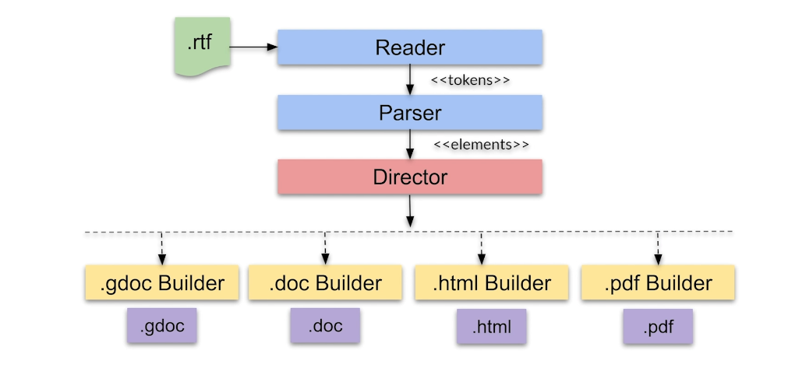
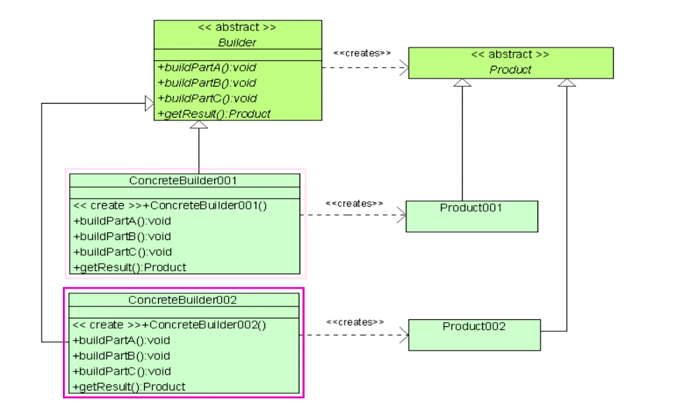

# Builder Pattern

## Overview

The Builder Pattern is a creational design pattern that allows for the encapsulation of the reusable logic involved in constructing complex objects.

### What Constitutes a Complex Object?

Complex objects typically have the following characteristics:

1. **Composition of Distinct Parts**: These objects are composed of multiple, distinct components that contribute to their overall structure and functionality.
2. **Defined Relationships**: There exists a well-defined relationship between the various components, dictating how they interrelate and contribute to the whole object.

### Key Principles of the Builder Pattern

The Builder Pattern is grounded in several core principles:

1. **Separation of Construction and Representation**: This principle emphasizes the decoupling of the construction process of an object from the representation of that object, allowing developers to focus on each aspect independently.

2. **Flexibility in Construction Process**: The design should be structured such that the same construction process can yield different representations of the object. This is particularly useful for creating variations of the same type of object based on differing requirements or contexts.

### Additional Information

- **Use Cases**: The Builder Pattern is particularly useful in scenarios where a class needs to be instantiated with a large number of parameters. It helps manage the complexity by allowing step-by-step construction.
  
- **Implementations**: In practice, the Builder Pattern typically involves a `Builder` class which constructs the complex object and a `Director` class that governs the construction process. The client interacts with the Builder to create specific representations of the complex object.

- **Advantages**:
    - Enhances code readability and maintainability.
    - Reduces the likelihood of errors during object creation by enforcing a step-by-step approach.
    - Makes it easier to add new configurations without affecting existing code.

### When to Use the Builder Pattern

The Builder Pattern is particularly beneficial in the following scenarios:

1. **Complex Classes with Multiple Constructors**: 
   - When you have a complex class that requires many constructors, the Builder Pattern provides a more manageable approach, allowing you to construct objects in a step-by-step manner. This flexibility enables you to skip unnecessary steps.

2. **Complex Composite Tree Structures**: 
   - If you need to build complex composite tree objects, the Builder Pattern is an ideal choice. It allows you to build these objects hierarchically and configure them piece by piece, ensuring each part is correctly established before moving on.

3. **Different Representations of a Complex Object**:
   - When you want to create various representations of the same complex object while still adhering to a consistent construction process, the Builder Pattern facilitates this by separating the representation from the construction, allowing for diverse configurations without redundancy.

### When Not to Use the Builder Pattern

While the Builder Pattern is powerful, it is not always necessary. Here are situations where its use may be unwarranted:

1. **Simple Objects**: 
   - The Builder Pattern is not suitable for simple objects that do not require significant configuration. For cases with straightforward instantiation where only a few parameters are involved, using a Factory Method may be more efficient and appropriate.

2. **Performance Constraints**:
   - In performance-critical applications, the overhead associated with constructing objects via the Builder Pattern may introduce latency that is unacceptable. In such cases, direct instantiation may be preferable.

3. **Increased Complexity for Simple Scenarios**:
   - If the scenario does not genuinely benefit from the additional structure provided by the Builder Pattern, applying it might complicate the design unnecessarily. For simple constructs, it is often better to use simpler design patterns.

### Advantages of the Builder Pattern

1. **Clear Separation of Concerns**: The Builder Pattern provides a distinct separation between the construction and representation of an object. This enables developers to focus on how the object is built independently from how it is used.
  
2. **Fine-Grained Control**: It allows for finer control over the steps of the construction process, enabling the creation of complex objects step-by-step and allowing parts to be configured as needed.

3. **Flexibility in Object Representation**: The Builder Pattern supports changes to the internal representation of objects without altering the code that uses the constructed objects. This makes it easier to maintain and adapt your code over time.

4. **Stepwise Construction**: It enables the stepwise construction of objects, making it simpler to understand the creation process and test individual components.

5. **Enhanced Readability**: The use of a builder increases the readability of the code, as it clearly outlines the construction process, facilitating collaboration among developers.

### Disadvantages of the Builder Pattern

1. **Require a Distinct Builder for Each Object**: A distinct Concrete Builder must be created for each type of object, which can lead to a proliferation of builder classes, increasing boilerplate code.

2. **Mutability of Builder Classes**: Builder classes must be mutable, which can lead to issues in multithreaded environments if not designed properly.

3. **Complexity in Dependency Injection**: The Builder Pattern may complicate dependency injection scenarios, as it introduces additional components that need to be managed within the application's architecture.

4. **Overhead for Simple Objects**: For simple objects that do not require complex construction logic, the Builder Pattern may introduce unnecessary overhead, making it less efficient.

5. **Learning Curve**: There may be a learning curve associated with understanding and implementing the Builder Pattern correctly, especially for developers new to design patterns.

### Conclusion

The Builder Pattern offers a robust solution for constructing complex objects in a flexible and organized manner, ensuring clarity and maintainability in your codebase.
