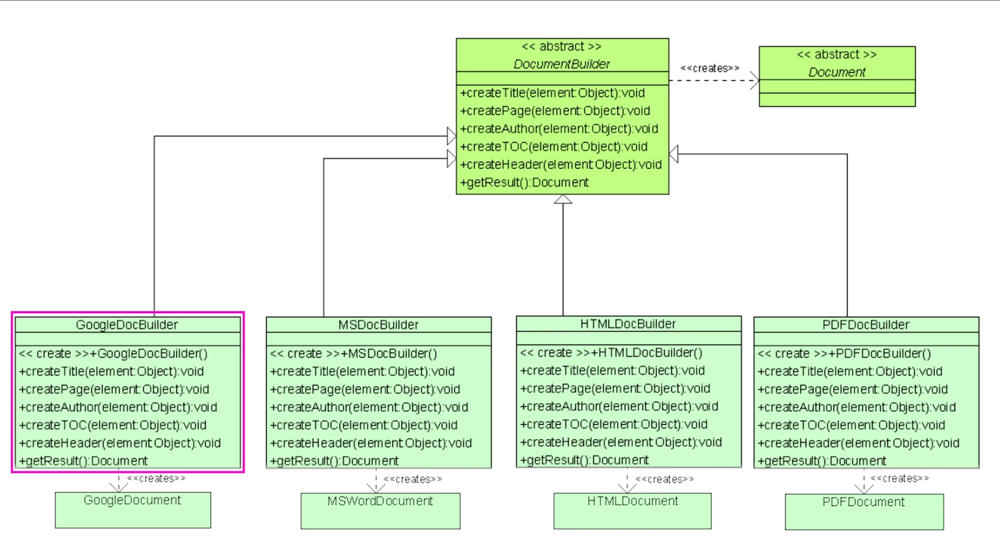

# Builder Pattern Examples

## Example 1

Consider the following scenario: Imagine that you are coding the process of building a house for a video game. A house can be a complex object with numerous attributes, which may include:

    1. Walls
    2. Windows
    3. Floors
    4. Garage
    5. Swimming Pool
    6. Doors
    7. Backyard
    8. Garden
    9. Basement
    10. Roof

This structure reflects a hierarchy of components that make up the house, each contributing to its overall functionality and appearance.

To design this object in a way that adheres to the Builder Pattern principles, you might create a `House` class along with a `HouseBuilder` to simplify the construction process. Instead of having a long and complex constructor for the `House` class, you could implement something like this:

```python
from __future__ import annotations

class House:
    def __init__(
        self,
        walls: int,
        windows: int,
        floors: int,
        garage: bool,
        swimming_pool: bool,
        doors: int,
        backyard: bool,
        garden: bool,
        basement: bool,
        roof: bool,
    ) -> None:
        self.walls = walls
        self.windows = windows
        self.floors = floors
        self.garage = garage
        self.swimming_pool = swimming_pool
        self.doors = doors
        self.backyard = backyard
        self.garden = garden
        self.basement = basement
        self.roof = roof

class HouseBuilder:
    def __init__(self) -> None:
        self.walls: int = 0
        self.windows: int = 0
        self.floors: int = 0
        self.garage: bool = False
        self.swimming_pool: bool = False
        self.doors: int = 0
        self.backyard: bool = False
        self.garden: bool = False
        self.basement: bool = False
        self.roof: bool = False

    def set_walls(self, walls: int) -> HouseBuilder:
        self.walls = walls
        return self

    def set_windows(self, windows: int) -> HouseBuilder:
        self.windows = windows
        return self

    def set_floors(self, floors: int) -> HouseBuilder:
        self.floors = floors
        return self

    def add_garage(self) -> HouseBuilder:
        self.garage = True
        return self

    def add_swimming_pool(self) -> HouseBuilder:
        self.swimming_pool = True
        return self

    def set_doors(self, doors: int) -> HouseBuilder:
        self.doors = doors
        return self

    def add_backyard(self) -> HouseBuilder:
        self.backyard = True
        return self

    def add_garden(self) -> HouseBuilder:
        self.garden = True
        return self

    def add_basement(self) -> HouseBuilder:
        self.basement = True
        return self

    def add_roof(self) -> HouseBuilder:
        self.roof = True
        return self

    def build(self) -> House:
        return House(
            self.walls,
            self.windows,
            self.floors,
            self.garage,
            self.swimming_pool,
            self.doors,
            self.backyard,
            self.garden,
            self.basement,
            self.roof,
        )

builder: HouseBuilder = HouseBuilder()
my_house: House = (
    builder.set_walls(4)
    .set_windows(10)
    .set_floors(2)
    .add_garage()
    .add_swimming_pool()
    .set_doors(3)
    .add_backyard()
    .add_garden()
    .add_basement()
    .add_roof()
    .build()
)
```

## Example 2

